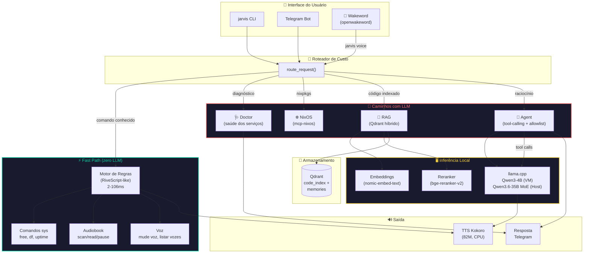
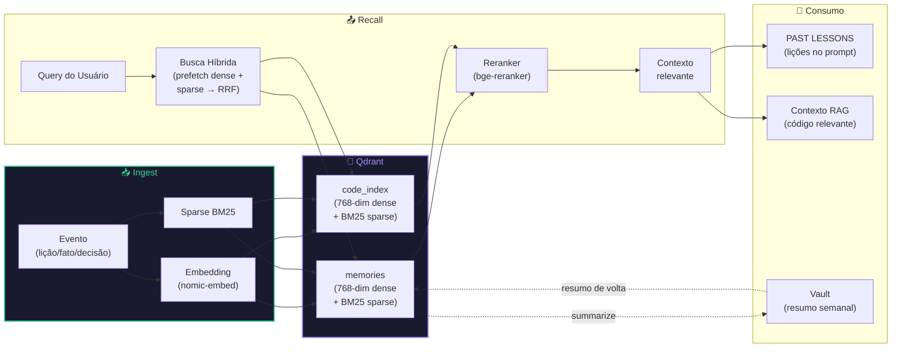

# ❄️ nixos-ai — JARVIS on NixOS

**"IA de bordo" 100% local-first e declarativa**: uma configuração NixOS
modular e reprodutível que nasce do zero no hardware físico (Acer Nitro V15,
RTX 4050 6GB / 32GB RAM) com um sistema de IA que se auto-cura, se auto-melhora
e não fica parada — tudo rodando local (llama.cpp + Qdrant), sem cloud.

> **Sincronia de premissas**: todo agente que trabalha neste repo (Codebuff,
> Gemini, ChatGPT/Codex, Cursor, o próprio JARVIS) lê o
> [`AGENTS.md`](AGENTS.md) — fonte única de premissas, regras e estado atual.
> Use `jarvis handoff` para gerar o pacote de contexto pronto para colar em
> IAs web (ver [Uso](#uso)).

---

## ✨ O que o JARVIS faz hoje (12 fases implementadas)

| Área | O que faz |
|---|---|
| 🧠 **Inferência local** | `llama.cpp` — chat (Qwen3-4B no lab / Qwen3.6-35B-A3B MoE + vision no host), embeddings (nomic), reranker (bge, NDCG@5=1.0) |
| 🔎 **RAG híbrido** | Qdrant dense + sparse BM25 + RRF ponderado + cross-encoder — NDCG@5 **1.0** |
| 🤖 **Agente** | tool-calling com allowlist + aprovação + audit JSONL + MCP (mcp-nixos) + roteador por custo |
| 🩺 **Self-heal** | `jarvis doctor` + `jarvis heal` (restart allowlist, cooldown, lição na memória) |
| 🧠 **Memória** | episódica (Qdrant, auto-aprendizado) + vault markdown git-syncado (resumo semanal) |
| 🛋️ **Modo idle** | self-knowledge quando ocioso (benchmark/regressão/eval-rag) |
| 📱 **Canais** | Telegram (long-polling, aprovação inline, `/ask` `/agent` `/status`) |
| 🎙️ **Voz** | wakeword (openwakeword) → STT (faster-whisper) → roteador → TTS (Kokoro) + emoção |
| 📖 **Audiobook** | leitura de .epub/.txt com chunking, TTS Kokoro e bookmark |
| 📊 **Qualidade** | `benchmark`, `eval-rag`, `regression` (baseline + CI via `flake check`) |
| 🔒 **Security** | anti-chaining, tool whitelist, empty cmd guard, threat model documentado |
| 📟 **Observabilidade** | logging JSONL centralizado, `jarvis metrics`, doctor proativo (network/sockets/Btrfs) |
| 👤 **Perfil Adaptativo** | preferências locais (verbosity/tone/expertise), contexto temporal + sistema no prompt |
| 🔗 **Event Bus** | barramento asyncio leve: pub/sub por tópico, retry, DLQ, stats |
| 📷 **Vision** | captura de tela via grim/slurp (full/region/window) como tool do agente |
| ⚡ **Triggers** | automações declarativas: disk/doctor/cpu alerts com cooldown e idempotência |
| 🧪 **Testes** | 380+ testes: unit, integration, PBT (hypothesis), security, wakeword |
| 📝 **Property-Based Testing** | 31 testes adversariais com hypothesis para parsers e regex |

**Modelos 100% declarativos**: `modules/ai/models.nix` é a única fonte de
verdade — o host nasce com tudo no store Nix, sem download imperativo.

---

## 📐 Arquitetura Geral



---

## 🧠 Ciclo de Vida da Memória Episódica & Pipeline RAG



**Fluxo de escrita**: evento → embedding (nomic, 768-dim) + sparse BM25 → upsert no Qdrant (coleção `memories`). Deduplicação por texto. ID determinístico (crc32).

**Fluxo de leitura**: query → embedding → busca híbrida (prefetch dense + sparse, fusão RRF ponderada) → reranker cross-encoder → top-k contexto. Lições injetadas como `PAST LESSONS` no prompt do agente.

---

## 🏗️ Estrutura do Repositório

```
flake.nix                    ← inputs (nixpkgs 26.05, disko, stylix) + hosts
AGENTS.md                    ← premissas compartilhadas entre humano e IAs
HANDOFF.md                   ← estado atual + próximo trabalho

hosts/
  nixos-lab/configuration.nix   ← VM de validação (CPU puro)
  nitro-v15/
    configuration.nix           ← Host physical (RTX 4050 + iGPU)
    disko.nix                   ← Partições declarativas (2 NVMe)

modules/ai/
  models.nix                    ← ÚNICA FONTE DE VERDADE (URL + hash + perfis)
  package.nix                   ← Pacote Python (jarvis + jarvis-voice)
  jarvis/src/jarvis/
    core/                       ← Lógica: agent, router, memory, rag, heal, audiobook...
    providers/                  ← Adaptadores: llm, vector_store, telegram, mcp
    cli/main.py                 ← CLI: jarvis <subcommand>

modules/services/               ← Serviços declarativos (llama-cpp, qdrant, litellm...)
nixos/modules/                  ← Módulos base (audio, hyprland, zram...)
home-manager/                   ← Desktop (hyprland, waybar) + daemons IA

docs/
  architecture/                 ← Proposta, avaliação, diagnóstico
  audit/                        ← Baseline e inventário do legado
```

---

## 🚀 Instalação / Rebuild

### Host de Laboratório (VM)

```bash
./rebuild.sh
# ou
nixos-rebuild switch --flake .#nixos-lab
```

### Host Physical (Acer Nitro V15) — Guia Padrão Ouro

> ⚠️ **AVISO**: O disko vai apagar **completamente** os 2 NVMe. Faça backup
> de tudo antes de prosseguir.

#### Passo 1 — Boot e Conexão no Live USB

1. Baixe o ISO do NixOS 26.05: <https://nixos.org/download/>
2. Grave num USB (Rufus ou Etcher)
3. Boot pelo USB (F2 → Boot Menu no Acer Nitro V15)
4. Conecte-se à rede:

```bash
sudo systemctl start wpa_supplicant
nmtui  # conecte ao Wi-Fi
```

#### Passo 2 — Identificar os SSDs NVMe

```bash
# Liste os NVMe
sudo nvme list

# Identifique qual é Gen4 (rápido) vs Gen3 (lento)
sudo lspci -vv | grep -A 2 "Non-Volatile" | grep LnkSta
# Gen4 = 16GT/s | Gen3 = 8GT/s

# Copie os IDs EXATOS (use /dev/disk/by-id/*):
ls /dev/disk/by-id/nvme-*
```

> **Regra**: NVMe Gen4 → `/` + `/nix` (store + modelos = I/O intensivo).
> NVMe Gen3 → `/home` (dados do usuário).

#### Passo 3 — Preparar o Repositório

```bash
# Clone o repo
nix-env -iA nixos.git
git clone https://github.com/Kuchiriel/nixos-ai.git
cd nixos-ai

# Edite os device IDs no disko.nix
nano hosts/nitro-v15/disko.nix
# Substitua os device = "/dev/disk/by-id/nvme-XXXX..." pelos IDs reais
```

#### Passo 4 — Executar o Disko (APAGA OS DISCOS!)

```bash
# Instalação via disko (wipe completo dos 2 NVMe)
sudo nixos-install --flake .#nitro-v15 --disk-main system --disk-extra home
```

#### Passo 5 — Gerar e Rastrear hardware-configuration.nix

```bash
# O disko já montou /mnt — gere o hardware-config
sudo nixos-generate-config --root /mnt
cp /mnt/etc/nixos/hardware-configuration.nix ./hosts/nitro-v15/

# ADICIONE AO .gitignore (não commitar hardware-configuration):
echo "hosts/nitro-v15/hardware-configuration.nix" >> .gitignore
```

> **Importante**: remova linhas de bootloader do `hardware-configuration.nix`
> (já estão no `configuration.nix`).

#### Passo 6 — Instalação Final

```bash
# Rebuild para validar antes de rebootar
sudo nixos-install --flake .#nitro-v15
```

#### Passo 7 — Reboot e Primeira Boot

```bash
sudo reboot
# Remova o USB
# Login: nixos (senha definida na instalação)
```

#### Passo 8 — Pós-Boot: Variáveis de Ambiente e Validação

```bash
# Criar arquivo de chaves do LiteLLM (fora do git!)
sudo tee /etc/litellm.env > /dev/null <<'EOF'
GROQ_API_KEY=sua_chave_aqui
GEMINI_API_KEY=sua_chave_aqui
EOF
sudo chmod 600 /etc/litellm.env

# Criar arquivo do Telegram
sudo tee /etc/jarvis-telegram.env > /dev/null <<'EOF'
JARVIS_TELEGRAM_TOKEN=SEU_TOKEN
JARVIS_TELEGRAM_CHAT_ID=SEU_CHAT_ID
EOF
sudo chmod 600 /etc/jarvis-telegram.env

# Validar o sistema
jarvis doctor
jarvis hwdetect
jarvis hwprofile
```

---

## 🔧 Uso

```bash
# Core
jarvis status                 # saúde de llama.cpp + Qdrant
jarvis ask "pergunta"         # roteador: caminho mais barato
jarvis agent "tarefa"         # agente tool-calling (--approve p/ efeito)
jarvis chat "pergunta"        # resposta direta via llama.cpp

# RAG e Indexação
jarvis rag "busca"            # busca híbrida no código
jarvis index <dir>            # indexa código no Qdrant

# Diagnóstico e Observabilidade
jarvis doctor                 # diagnóstico completo (--json p/ saída pura)
jarvis doctor --json          # JSON para dashboards/Telegram
jarvis metrics                # métricas dos logs (--module, --since, --json)
jarvis heal                   # auto-reparo (--watch p/ daemon)

# Memória
jarvis remember "fato"        # grava na memória episódica
jarvis recall "busca"         # recupera eventos
jarvis lessons "erro"         # lições passadas relevantes
jarvis vault summarize        # resumo de longo prazo

# Perfil Adaptativo
jarvis profile show           # mostra preferências atuais
jarvis profile set tone friendly   # define uma preferência
jarvis profile forget restrictions # remove uma preferência

# Voz e Audiobook
jarvis audiobook scan|read    # leitor de livros com TTS
jarvis voice                  # loop STT → roteador → TTS
jarvis stt <wav>              # transcreve áudio
jarvis speak "texto"          # sintetiza texto em voz

# Hardware e Integração
jarvis hwdetect               # detecta hardware e classifica tier
jarvis hwprofile              # calcula flags SOTA + melhor modelo
jarvis screenshot full|region|window  # captura de tela (Wayland/Hyprland)
jarvis triggers run|status    # motor de automações por gatilhos
jarvis handoff --task "..."   # pacote de contexto para IAs web
jarvis telegram               # canal Telegram
jarvis idle status            # estado do modo idle
```

---

## 🤝 Trabalho em Paralelo com IAs

1. **`AGENTS.md`** — premissas, regras e perfil do usuário. Qualquer IA lê e começa com o mesmo contexto.
2. **`jarvis handoff`** — gera um bloco markdown (AGENTS.md + git log + tarefa) para colar em Gemini/ChatGPT.
3. **Git como sensor** — commits pequenos e frequentes; `git log --oneline -5` mostra o que mudou.

---

## 🤖 Modelos (100% Declarativos)

| Modelo | Uso | Tamanho | Host |
|---|---|---|---|
| Qwen3-4B Q4_K_M | Chat (VM) | 2.5GB | CPU puro |
| Qwen3.6-35B-A3B UD-Q4_K_M | Chat (Host) | ~20.6GB | RTX 4050 + 32GB RAM |
| nomic-embed-text-v2-moe Q8_0 | Embeddings | 512MB | CPU |
| bge-reranker-v2-m3 Q4_K_M | Reranker | 438MB | CPU |
| Kokoro-82M | TTS | <1GB | CPU |
| faster-whisper-small | STT | ~500MB | CPU / iGPU (SYCL) |
| openwakeword v0.5.1 | Wakeword | ~10MB | CPU |

**Troca de modelo**: edite `modules/ai/models.nix` → `./rebuild.sh` → `nh clean` (remove o antigo do store).

---

## 📚 Documentação

- [`docs/architecture/proposal.md`](docs/architecture/proposal.md) — arquitetura alvo e plano incremental
- [`docs/architecture/system-assessment.md`](docs/architecture/system-assessment.md) — ranqueamento da stack vs ecossistema
- [`docs/architecture/pillar-diagnostic.md`](docs/architecture/pillar-diagnostic.md) — diagnóstico dos 4 pilares de arquitetura
- [`docs/audit/`](docs/audit/) — baseline e auditorias (inclui inventário do legado Manjaro)

---

## 🤝 Contribuições

- Commits pequenos e semânticos (`feat(ai): …`, `fix(nixos): …`, `test(rag): …`), em PT-BR.
- Sem alterações imperativas em `~/.config`; estado separado da configuração.
- **Antes de commitar**: `git add -A` + `nix build .#jarvis` (pytest) + `nix flake check`.

---

## ⚠️ Notas Conhecidas

- **Qdrant pós-upgrade**: se `systemctl status qdrant` mostrar `failed` após upgrade de base, rode `sudo ./fix-qdrant.sh`.
- **Limpeza de disco**: `./clean.sh` (GC do Nix) ou `nix-collect-garbage -d`.
- **SQLite warning**: `unable to open database file` do mcp-nixos — benigno, cache de canais funciona normalmente.
- **NVIDIA na VM**: `No NVIDIA GPU found` no dmesg — esperado (sem PCIe passthrough).
