# ❄️ nixos-ai — JARVIS on NixOS

**"Ia de bordo" 100% local-first e declarativa**: uma configuração NixOS
modular e reprodutível que nasce do zero no hardware físico (Acer Nitro V15,
RTX 4050 6GB / 32GB RAM) com um sistema de IA que se auto-cura, se auto-melhora
e não fica parada — tudo rodando local (llama.cpp + Qdrant), sem cloud.

> **Sincronia de premissas**: todo agente que trabalha neste repo (Codebuff,
> Gemini, ChatGPT/Codex, Cursor, o próprio JARVIS) lê o
> [`AGENTS.md`](AGENTS.md) — fonte única de premissas, regras e estado atual.
> Use `jarvis handoff` para gerar o pacote de contexto pronto para colar em
> IAs web (ver [Uso](#uso)).

## ✨ O que o JARVIS faz hoje (11 fases implementadas)

| Área | O que faz |
|---|---|
| 🧠 **Inferência local** | `llama.cpp` — chat (Qwen3-4B no lab / Qwen3.6-35B-A3B MoE + vision no host), embeddings dedicado (nomic), reranker (bge, NDCG@5=1.0) |
| 🔎 **RAG híbrido** | Qdrant dense + sparse BM25 + RRF ponderado + cross-encoder — NDCG@5 **1.0**, 11/11 queries |
| 🤖 **Agente** | tool-calling com allowlist + aprovação + audit JSONL + cliente MCP (mcp-nixos) + roteador por custo (`jarvis ask`: fastpath → doctor → nixos → rag → agent) |
| 🩺 **Self-heal** | `jarvis doctor` (saúde de todos os serviços) + `jarvis heal` (restart com allowlist, cooldown, lição na memória ao errar) |
| 🧠 **Memória** | episódica (Qdrant, auto-aprendizado ao falhar) + **vault markdown git-syncado** (resumo semanal automático por timer) |
| 🛋️ **Modo idle** | quando o sistema está ocioso (carga + IdleHint), roda self-knowledge (benchmark/regressão/eval-rag) com yield automático de CPU/IO |
| 📱 **Canais** | Telegram (long-polling, allowlist, aprovação inline [Sim]/[Não], roteamento `/ask` `/agent` `/status`) |
| 🎙️ **Voz** | wakeword (openwakeword, calibrado com RNNoise) → STT (faster-whisper, VAD) → roteador → TTS (Kokoro) + emoção por keywords |
| 📊 **Qualidade medida** | `jarvis benchmark` (latência por rota), `eval-rag` (NDCG/Recall), `regression` (baseline + CI via `flake check`) |

**Modelos 100% declarativos**: `modules/ai/models.nix` é a única fonte de
verdade (URL + hash + perfis `vm`/`host`) — o host nasce com tudo no store
Nix, sem download imperativo, sem resíduo (troca de modelo = editar o arquivo
+ `nh clean`).

## 🚀 Instalação / rebuild

```bash
# Host de laboratório (VM)
./rebuild.sh
# ou
nixos-rebuild switch --flake .#nixos-lab
```

> ⚠️ **Qdrant pós-upgrade**: se `systemctl status qdrant` mostrar `failed`
> após um upgrade de base (storage 24.11 incompatível com 26.05), rode
> `sudo ./fix-qdrant.sh` (descarta estado de runtime recriável e reinicia).
> Limpeza de disco: `./clean.sh` (GC do Nix).

## 🔧 Uso

```bash
jarvis status                 # saúde de llama.cpp + Qdrant
jarvis ask "pergunta"         # roteador: caminho mais barato (regra → doctor → nixos → rag → agent)
jarvis agent "tarefa"         # agente tool-calling (--approve p/ comandos com efeito)
jarvis rag "busca"            # busca híbrida no código
jarvis index <dir>            # indexa código no Qdrant
jarvis doctor / jarvis heal   # diagnóstico / auto-reparo
jarvis remember|recall|lessons# memória episódica
jarvis vault summarize        # resumo de longo prazo (markdown git-syncado)
jarvis idle status            # estado do modo idle (tarefas devidas)
jarvis benchmark|eval-rag|regression   # qualidade medida
jarvis handoff --task "..."   # gera o pacote de contexto p/ colar em IAs web
jarvis telegram               # canal (exige token: /etc/jarvis-telegram.env)
jarvis voice                  # loop STT → roteador → TTS
```

## 🤝 Trabalho em paralelo com IAs (a parte diferente)

Este repo foi desenhado para **várias IAs trabalharem juntas sem pisar nos pés**:

1. **`AGENTS.md`** — premissas, regras intransigíveis, estado atual e perfil do
   usuário. Qualquer IA que ler este arquivo começa com o mesmo contexto.
2. **`jarvis handoff`** — gera um bloco markdown (AGENTS.md + últimos commits +
   árvore de trabalho + sua tarefa) para **colar em Gemini/ChatGPT no
   navegador**. A IA web começa com as mesmas premissas que os agentes locais.
3. **Git como sensor de mudanças** — commits pequenos e frequentes; antes de
   trabalhar, `git log --oneline -5` + `git status` mostram o que mudou.

## 🏗️ Estrutura

```
flake.nix                 ← inputs, overlays e definição dos hosts
AGENTS.md                 ← premissas compartilhadas entre humano e IAs
hosts/nixos-lab/          ← host ativo (VM de validação)
modules/ai/               ← models.nix (fonte única) + fontes do JARVIS (jarvis/)
modules/services/         ← serviços declarativos (llama-cpp, qdrant, jarvis-*)
nixos/modules/            ← módulos base do sistema
home-manager/             ← configuração do usuário (desktop + daemons IA)
docs/                     ← baseline, auditorias, decisões e avaliação de arquitetura
```

## 📚 Documentação

- [`docs/architecture/proposal.md`](docs/architecture/proposal.md) — arquitetura alvo e plano incremental
- [`docs/architecture/system-assessment.md`](docs/architecture/system-assessment.md) — ranqueamento da stack vs ecossistema, gargalos, roadmap (o "mapa" do projeto)
- [`docs/audit/`](docs/audit/) — baseline e auditorias (inclui inventário do sistema legado Manjaro)

## 🤝 Contribuições / convenções

- Commits pequenos e semânticos (`feat(ai): …`, `fix(nixos): …`, `test(rag): …`), em PT-BR.
- Sem alterações imperativas em `~/.config`; estado da aplicação separado da configuração.
- **Antes de commitar**: `git add -A` (o flake só copia arquivos trackeados),
  `nix build .#jarvis` (roda pytest) e `nix flake check`.

```mermaid
graph TD
    %% 
    %% STYLES & CLASSES
    %% 
    classDef hw fill:#1e1e2e,stroke:#89b4fa,stroke-width:2px,color:#cdd6f4
    classDef btrfs fill:#181825,stroke:#a6e3a1,stroke-width:1px,color:#a6e3a1
    classDef service fill:#313244,stroke:#f5c2e7,stroke-width:1px,color:#cdd6f4
    classDef gateway fill:#45475a,stroke:#fab387,stroke-width:2px,color:#fab387
    classDef cloud fill:#11111b,stroke:#b4bfe2,stroke-dasharray: 5 5,color:#b4bfe2

    %% 
    %% HARDWARE & INFRASTRUCTURE
    %% 
    subgraph AcerNitro[" Acer Nitro V15 (Host Physical)"]
        direction TB

        subgraph Storage[" Storage Topography (Dual NVMe)"]
            subgraph NVMe_A[" NVMe Gen4 (System / Nix Store)"]
                Sub_Nix["/nix (Nix Store + Models)"]:::btrfs
                Sub_Root["/ (Root Filesystem)"]:::btrfs
                Sub_Tmp["/tmp & /var/tmp"]:::btrfs
            end

            subgraph NVMe_B[" NVMe Gen3 (User Data)"]
                Sub_Home["/home (User Data & Configs)"]:::btrfs
            end
        end

        subgraph Hardware_Offload[" Processing Engine"]
            CPU_RAM["Intel Core i7-13620H + 32GB RAM"]:::hw
            dGPU["NVIDIA RTX 4050 (Offload VRAM)"]:::hw
            iGPU["Intel UHD Graphics (SYCL / VA-API)"]:::hw
        end

        %% 
        %% NIXOS AI & SERVICES MESH
        %% 
        subgraph AIMesh[" NixOS Local AI Mesh"]
            direction TB

            subgraph Ingress[" User Ingress & Interface"]
                Telegram["jarvis-telegram.service<br/><i>Telegram Bot / Async Approvals</i>"]:::service
                ShellCLI["jarvis CLI / Doctor"]:::service
            end

            subgraph GatewayLayer[" Gateway & Cascading Engine"]
                LiteLLM["litellm.service<br/><b>Porta 127.0.0.1:4000</b><br/><i>Cascade Proxy & Cost Tracking</i>"]:::gateway
            end

            subgraph InferenceEngine[" Local Inference Cluster (llama-cpp)"]
                LlamaMain["llama-cpp-server.service<br/><b>Porta 0.0.0.0:8080</b><br/><i>Qwen3.6-35B MoE + Vision</i>"]:::service
                LlamaRerank["llama-cpp-rerank.service<br/><b>Porta 0.0.0.0:8081</b><br/><i>Reranking Model</i>"]:::service
                LlamaEmbed["llama-cpp-embeddings.service<br/><i>Embeddings Generator</i>"]:::service
            end

            subgraph StorageMemory[" Context & Vector Database"]
                Qdrant["qdrant.service<br/><b>Porta 127.0.0.1:6333</b><br/><i>Vector Search Engine</i>"]:::service
            end

            subgraph AutonomousServices[" Autonomous Daemon Services"]
                JarvisIdle["jarvis-idle.nix<br/><i>Idle / Offload Tasks</i>"]:::service
                JarvisHeal["jarvis-heal.nix<br/><i>Self-Healing & Monitor</i>"]:::service
                JarvisVault["jarvis-vault.nix<br/><i>Encrypted Secrets (/etc/*.env)</i>"]:::service
            end
        end
    end

    %% 
    %% EXTERNAL CLOUD FALLBACKS
    %% 
    subgraph CloudCascade[" Cloud Provider Cascades"]
        Groq["Groq API<br/><i>(High Speed Fallback)</i>"]:::cloud
        Gemini["Gemini API<br/><i>(High Context Fallback)</i>"]:::cloud
        OpenRouter["OpenRouter API<br/><i>(Extended Fallback)</i>"]:::cloud
    end

    %% 
    %% FLOWS & DATA PIPELINES
    %% 
    %% Input Routing
    Telegram -->|Prompt Request| LiteLLM
    ShellCLI -->|Direct Query| LiteLLM

    %% LiteLLM Cascade Strategy
    LiteLLM -->|1º Try: Local Model :8080| LlamaMain
    LiteLLM -.->|2º Fallback| Groq
    LiteLLM -.->|3º Fallback| Gemini
    LiteLLM -.->|4º Fallback| OpenRouter

    %% Local Inference & Storage Interactions
    LlamaMain -->|Vector Retrieval| Qdrant
    LlamaMain -->|Rerank Documents :8081| LlamaRerank
    LlamaEmbed -->|Generate Vectors| Qdrant

    %% Hardware Execution
    LlamaMain -->|GPU Layers Offload| dGPU
    LlamaMain -->|RAM / CPU Offload| CPU_RAM
    
    %% Storage Backing
    LlamaMain -->|Load Model Weights| Sub_Nix
    Qdrant -->|Persist DB State| Sub_Root
    Telegram -->|Logs / Config| Sub_Home
    JarvisVault -->|Inject Secrets| Telegram
    JarvisVault -->|Inject Secrets| LiteLLM
```


