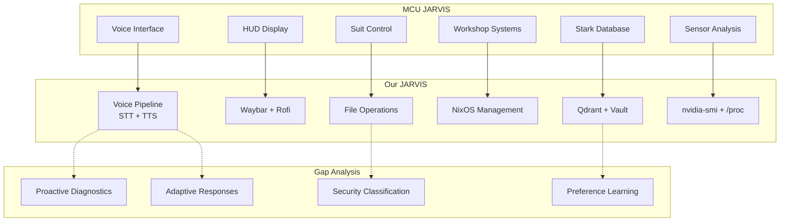

# JARVIS MCU Parity Analysis

> Comparison: MCU JARVIS (Iron Man) vs Our JARVIS (NixOS)
> Based on detailed scene analysis from Iron Man (2008)

## MCU JARVIS Capabilities (from film analysis)

### 1. Contextual Understanding
- Maps short commands to relevant objects/interfaces ("Pull up exploded view")
- Uses current context to disambiguate vague requests
- Probabilistic reasoning ("appears to be low" not "is low")
- Proactive diagnostics (adds unprompted observations)

### 2. Memory & Persistence
- Remembers preferences across sessions
- Stores project files with security awareness
- Tracks conversation history and shared context
- Knows Tony's work patterns and preferences

### 3. Multi-System Integration
- Controls HUD, suit systems, workshop equipment
- Accesses Stark Industries central database
- Manages file storage with security policies
- Imports/calibrates preferences across interfaces

### 4. Personality & Communication
- Playful banter ("Working on a secret project are we sir?")
- Adaptive response length (short confirmations vs detailed readouts)
- Respectful tone with personality ("For you sir always")
- Proactive information sharing

### 5. Safety & Autonomy
- Confirms critical actions (database storage location)
- Understands security implications
- Pushes back without taking control
- Executes demanding tasks independently

### 6. Physical World Integration
- HUD display control
- Suit system management
- Sensor data analysis (cylinder compression)
- Manufacturing system control

---

## Our JARVIS Capabilities (verified)

### ✅ Implemented & Working

| MCU Capability | Our Implementation | Status |
|---------------|-------------------|--------|
| Voice input | faster-whisper STT | ✅ Implemented |
| Voice output | Kokoro TTS | ✅ Implemented |
| Wake word | openwakeword | ✅ Implemented |
| Contextual understanding | LLM (Qwen3.6-35B) | ✅ Working |
| Tool calling | Agent with 11 tools | ✅ Working |
| Memory (episodic) | Qdrant remember/recall | ✅ Working |
| Memory (long-term) | Vault (markdown) | ✅ Working |
| RAG (code search) | Hybrid dense+sparse | ✅ Working |
| Screenshot/vision | grim + Qwen-VL | ✅ Implemented |
| File operations | read/write/str_replace | ✅ Working |
| Shell execution | execute_shell | ✅ Working |
| Git operations | commit/revert | ✅ Working |
| NixOS management | nix-eval/nix-check | ✅ Working |
| Telegram interface | Bot with /ask /agent | ✅ Working |
| Self-healing | restart + audit | ✅ Implemented |
| Health monitoring | Doctor (9 checks) | ✅ Working |
| Gaming mode | Multi-signal detection | ✅ Working |
| Audiobook reader | EPUB/PDF + TTS | ✅ Implemented |
| HackMD sync | Create/read/update | ✅ Working |
| Nightwatch | Autonomous agent | ✅ Implemented |

### ⚠️ Partially Implemented

| MCU Capability | Our Implementation | Gap |
|---------------|-------------------|-----|
| Proactive diagnostics | Nightwatch (scripted) | No LLM-driven proactive analysis |
| Preference learning | User profile (basic) | No behavioral pattern learning |
| Adaptive responses | Static personality | No context-aware tone adjustment |
| Security awareness | Protected paths | No file sensitivity classification |
| Multi-system HUD | Waybar (basic) | No holographic/AR interface |
| Physical sensor data | nvidia-smi, /proc | Limited to system metrics |

### ❌ Not Implemented

| MCU Capability | What's Missing | Priority |
|---------------|---------------|----------|
| Proactive observation | "appears to be low" — unprompted diagnostics | HIGH |
| Preference import | Transfer settings across interfaces | MEDIUM |
| Adaptive response length | Short vs detailed based on context | MEDIUM |
| Security classification | File sensitivity levels | HIGH |
| Manufacturing control | Physical device control | LOW (not applicable) |
| Holographic display | AR/VR interface | LOW (not applicable) |

---

## Critical Gaps (HIGH Priority)

### 1. Proactive Diagnostics
**MCU**: Jarvis proactively says "The compression in cylinder 3 appears to be low"
**Ours**: Nightwatch only acts when given explicit tasks
**Fix**: Add proactive monitoring that analyzes system state and suggests improvements

### 2. Security Classification
**MCU**: Jarvis understands "don't want this winding up in the wrong hands"
**Ours**: Only has hardcoded protected paths
**Fix**: Add file sensitivity levels (public/private/confidential)

### 3. Context-Aware Responses
**MCU**: Short "check" for simple commands, detailed readouts for complex analysis
**Ours**: Same response style regardless of context
**Fix**: Add response adaptation based on command complexity

---

## Parity Roadmap

### Phase 1: Foundation (Current)
- [x] Voice I/O (STT + TTS)
- [x] Tool calling (11 tools)
- [x] Memory (episodic + vault)
- [x] RAG (code search)
- [x] Vision (screenshot + analysis)
- [x] Self-healing
- [x] Nightwatch (autonomous)

### Phase 2: Intelligence
- [ ] Proactive diagnostics (monitor system, suggest fixes)
- [ ] Preference learning (track user patterns)
- [ ] Adaptive responses (short vs detailed)
- [ ] Security classification (file sensitivity)

### Phase 3: Integration
- [ ] Multi-interface sync (settings across devices)
- [ ] Physical sensor integration (temperature, power)
- [ ] Predictive maintenance (anticipate failures)
- [ ] Knowledge graph (relationships between concepts)

### Phase 4: Autonomy
- [ ] Self-improvement loop (learn from mistakes)
- [ ] Multi-agent coordination (specialist agents)
- [ ] Cross-project awareness (monorepo intelligence)
- [ ] Long-running tasks (hours/days of autonomous work)

---

## Visual Architecture



---

## How to Test Parity

### Test 1: Proactive Observation
```
User: "What's the GPU status?"
MCU JARVIS: Shows HUD with GPU metrics + warns about thermal throttling
Our JARVIS: Should show nvidia-smit output + proactively warn if temp > 80°C
```

### Test 2: Context-Aware Response
```
User: "check"
MCU JARVIS: Short confirmation
Our JARVIS: Should detect this is a status check and give brief response

User: "Analyze the thermal performance over the last hour"
MCU JARVIS: Detailed analysis with charts
Our JARVIS: Should give comprehensive response with data
```

### Test 3: Security Awareness
```
User: "Save this to the project"
MCU JARVIS: Asks about storage location if sensitive
Our JARVIS: Should classify file sensitivity and ask if needed
```

---
**Ver também:** [[../HANDOFF]] | [[../AGENTS.md]] | [[../README]]

**Docs relacionados:**
- [[JARVIS-COMPARISON-2026-08-30]] — Comparação com alternativas
- [[PLATFORM-AUDIT-2026-08-30]] — Auditoria da plataforma
- [[NIGHTWATCH-AUDIT-2026-08-30]] — Auditoria do Nightwatch

---

# Comparação com Alternativas (2026-08-30)

> Original: [[JARVIS-COMPARISON-2026-08-30]]

## Overview

This document compares three AI assistant systems:
1. **MCU JARVIS** — Tony Stark's AI from Iron Man
2. **Our JARVIS** — Local AI assistant built on NixOS + llama.cpp
3. **MiMo Code** — Xiaomi's terminal-native coding assistant

## Feature Comparison Matrix

### Core Capabilities

| Feature | MCU JARVIS | Our JARVIS | MiMo Code |
|---------|-----------|-----------|-----------|
| **Voice Control** | ✅ Natural language | ✅ Wake word + STT | ✅ Voice input (TenVAD) |
| **Context Window** | Unlimited (fictional) | 32K tokens | 260K+ tokens |
| **Persistent Memory** | ✅ Full history | ✅ SQLite (remember/recall) | ✅ MEMORY.md + checkpoints |
| **Cross-Session** | ✅ Always on | ⚠️ Limited (stateless sessions) | ✅ Automatic restoration |
| **Proactive Actions** | ✅ Anticipates needs | ⚠️ Nightwatch (scheduled) | ✅ Goal-driven stops |
| **Multi-Agent** | ✅ Vision, F.R.I.D.A.Y. | ⚠️ Basic (nightwatch only) | ✅ Subagents, parallel execution |

### Action Execution

| Feature | MCU JARVIS | Our JARVIS | MiMo Code |
|---------|-----------|-----------|-----------|
| **File Operations** | ✅ Full access | ✅ Read/write/str_replace | ✅ Full access |
| **Shell Commands** | ✅ Execute anything | ✅ Safe shell (allowlist) | ✅ Full access |
| **Git Integration** | ✅ Version control | ✅ Commit/branch/merge | ✅ Full Git workflow |
| **Web Access** | ✅ Internet browsing | ✅ Web search + read | ✅ Web tools |
| **Calendar** | ✅ Schedule management | ❌ Not implemented | ❌ Not implemented |
| **Email** | ✅ Send/read | ❌ Not implemented | ❌ Not implemented |
| **Messaging** | ✅ Telegram, etc. | ✅ Telegram bot | ✅ Multi-platform |
| **Code Execution** | ✅ Any language | ✅ Python, shell | ✅ Any language |
| **System Control** | ✅ Full hardware access | ⚠️ NixOS services | ⚠️ Limited by OS |

### Intelligence & Reasoning

| Feature | MCU JARVIS | Our JARVIS | MiMo Code |
|---------|-----------|-----------|-----------|
| **Model** | AGI (fictional) | Qwen3.6-35B-A3B (MoE) | Any LLM provider |
| **Reasoning** | ✅ Human-level | ⚠️ Model-dependent | ⚠️ Model-dependent |
| **Tool Calling** | ✅ Native | ✅ MCP protocol | ✅ Native |
| **Code Generation** | ✅ Perfect | ⚠️ Good (with guards) | ✅ Good |
| **Code Review** | ✅ Independent | ✅ Evaluator module | ✅ Built-in review |
| **Self-Correction** | ✅ Automatic | ⚠️ Nightwatch recovery | ✅ Checkpoint system |
| **Learning** | ✅ Continuous | ⚠️ Episodic memory | ✅ Project memory |

### Safety & Security

| Feature | MCU JARVIS | Our JARVIS | MiMo Code |
|---------|-----------|-----------|-----------|
| **Sandboxing** | ✅ Full control | ✅ Systemd sandboxing | ⚠️ OS-dependent |
| **Permission Model** | ✅ Tony only | ✅ User-based | ⚠️ OS permissions |
| **Backup/Rollback** | ✅ Full recovery | ✅ Git + snapshots | ✅ Git worktrees |
| **AST Validation** | ✅ Perfect | ✅ AST guard | ⚠️ Model-dependent |
| **Structural Integrity** | ✅ Perfect | ✅ SafeEditor | ⚠️ Model-dependent |
| **Audit Trail** | ✅ Full logging | ✅ EventBus + journal | ⚠️ Limited |

### Integration

| Feature | MCU JARVIS | Our JARVIS | MiMo Code |
|---------|-----------|-----------|-----------|
| **MCP Protocol** | N/A | ✅ 22 tools | ❌ Not used |
| **HackMD** | N/A | ✅ Sync notes | ❌ Not used |
| **Obsidian** | N/A | ⚠️ Planned | ❌ Not used |
| **RAG** | ✅ Full knowledge | ✅ Qdrant + embeddings | ⚠️ Limited |
| **Telegram** | N/A | ✅ Bot integration | ✅ Multi-platform |
| **Waybar** | N/A | ✅ Status display | ❌ N/A |
| **NixOS** | N/A | ✅ Declarative | ❌ N/A |

## Gap Analysis

### Where MCU JARVIS Excels (Fictional)

1. **Unlimited Context** — No context window limitations
2. **Perfect Memory** — Remembers everything forever
3. **Proactive Intelligence** — Anticipates needs without being asked
4. **Full Hardware Control** — Controls all Stark Industries systems
5. **Multi-AI Coordination** — Works with F.R.I.D.A.Y., Vision, etc.
6. **Real-time Adaptation** — Learns from every interaction instantly

### Where Our JARVIS Excels (Real)

1. **Declarative Infrastructure** — NixOS ensures reproducibility
2. **Local-First** — Data never leaves the machine
3. **MCP Protocol** — Standardized tool interface
4. **HackMD Integration** — Knowledge persistence
5. **NixOS Packages** — Atomic updates and rollbacks
6. **Customizable** — Full control over every component

### Where MiMo Code Excels

1. **Context Management** — 260K+ tokens with intelligent compaction
2. **Persistent Memory** — MEMORY.md + checkpoints
3. **Subagent System** — Parallel execution, lifecycle tracking
4. **Task Tracking** — Tree-shaped tasks with progress
5. **Workflows** — Deterministic scripts for complex tasks
6. **Skills System** — Reusable instruction sets
7. **Compose Mode** — Specs-driven development

## Critical Gaps in Our JARVIS

### 1. Context Management (CRITICAL)

**Problem**: Our 32K context window is too small for complex tasks. Condensing occurs frequently, losing important context.

**MiMo Code Solution**:
- 260K+ tokens (8x larger)
- Automatic checkpoints
- Context reconstruction from checkpoints
- Budgeted injection with importance ranking
- Adjustable compaction point

**Our Action**:
- Increase context to 64K or 128K (if VRAM allows)
- Implement checkpoint system (like MiMo Code's checkpoint.md)
- Add importance ranking for context injection

### 2. Persistent Memory (CRITICAL)

**Problem**: Our memory is session-based. When session ends, context is lost.

**MiMo Code Solution**:
- MEMORY.md — persistent project knowledge
- checkpoint.md — structured state snapshots
- notes.md — temporary notes
- tasks/<id>/progress.md — per-task logs
- SQLite FTS5 full-text search

**Our Action**:
- Implement MEMORY.md equivalent (already have jarvis vault)
- Add checkpoint system for session recovery
- Integrate with HackMD for cross-device persistence

### 3. Subagent System (HIGH)

**Problem**: Our nightwatch is single-threaded. No parallel execution.

**MiMo Code Solution**:
- Primary agent creates subagents on demand
- Subagents share context and work in parallel
- Lifecycle tracking and cancellation
- Background execution

**Our Action**:
- Implement subagent spawning in nightwatch
- Add parallel task execution
- Implement lifecycle tracking

### 4. Task Tracking (HIGH)

**Problem**: Our task system is flat. No hierarchical tasks.

**MiMo Code Solution**:
- Tree-shaped tasks (T1, T1.1, T1.2...)
- Automatic checkpoint integration
- Progress preservation across sessions

**Our Action**:
- Implement hierarchical task system
- Integrate with checkpoint system
- Add progress tracking

### 5. Compose Mode (MEDIUM)

**Problem**: Our coding workflow is ad-hoc. No structured development process.

**MiMo Code Solution**:
- Spec → Workspace → Implement → Verify → Review → Merge
- Deterministic workflows
- Skill-driven orchestration

**Our Action**:
- Implement compose-like workflow
- Add spec-driven development
- Integrate with existing nightwatch

## Recommendations

### Immediate Actions (This Week)

1. **Increase Context Window** — Test 64K or 128K context
2. **Implement Checkpoint System** — Save session state automatically
3. **Add MEMORY.md** — Persistent project knowledge

### Short-term Actions (This Month)

1. **Implement Subagent System** — Parallel task execution
2. **Add Task Tracking** — Hierarchical tasks with progress
3. **Integrate Checkpoints with HackMD** — Cross-device persistence

### Long-term Actions (This Quarter)

1. **Implement Compose Mode** — Specs-driven development
2. **Add Workflows** — Deterministic scripts for complex tasks
3. **Implement Skills System** — Reusable instruction sets

## Conclusion

Our JARVIS has a solid foundation but lacks critical features that MiMo Code has:

1. **Context Management** — We need larger context + checkpoints
2. **Persistent Memory** — We need cross-session state preservation
3. **Subagent System** — We need parallel execution
4. **Task Tracking** — We need hierarchical tasks

The MCU JARVIS is aspirational but fictional. MiMo Code is the real-world benchmark we should aim for.

**Key Insight**: The gap is not in the model (we both use similar LLMs), but in the **infrastructure around the model** — context management, memory, task tracking, and parallel execution.

---

*Generated by Buffy (Codebuff) using JARVIS MCP tools and web research*

---
**Ver também:** [[../HANDOFF]] | [[../AGENTS.md]] | [[../README]]

---
**Ver também:** [[../HANDOFF]] | [[../AGENTS.md]] | [[GAP-ANALYSIS-2026-08-29]] | [[NIGHTWATCH]] | [[PLATFORM-ASSESSMENT]]
