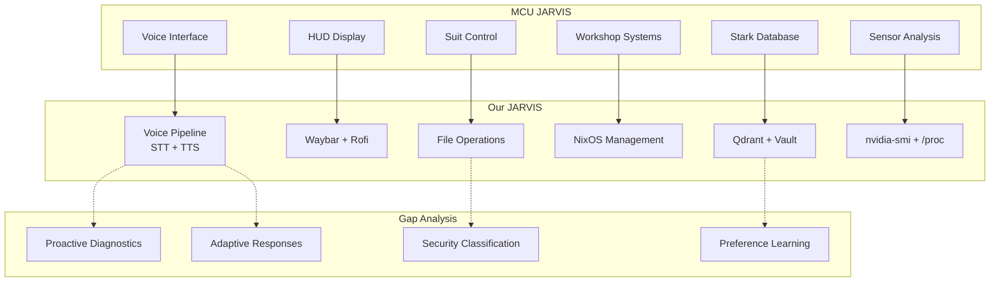

# JARVIS MCU Parity Analysis

> Comparison: MCU JARVIS (Iron Man) vs Our JARVIS (NixOS)
> Based on detailed scene analysis from Iron Man (2008)

## MCU JARVIS Capabilities (from film analysis)

### 1. Contextual Understanding
- Maps short commands to relevant objects/interfaces ("Pull up exploded view")
- Uses current context to disambiguate vague requests
- Probabilistic reasoning ("appears to be low" not "is low")
- Proactive diagnostics (adds unprompted observations)

### 2. Memory & Persistence
- Remembers preferences across sessions
- Stores project files with security awareness
- Tracks conversation history and shared context
- Knows Tony's work patterns and preferences

### 3. Multi-System Integration
- Controls HUD, suit systems, workshop equipment
- Accesses Stark Industries central database
- Manages file storage with security policies
- Imports/calibrates preferences across interfaces

### 4. Personality & Communication
- Playful banter ("Working on a secret project are we sir?")
- Adaptive response length (short confirmations vs detailed readouts)
- Respectful tone with personality ("For you sir always")
- Proactive information sharing

### 5. Safety & Autonomy
- Confirms critical actions (database storage location)
- Understands security implications
- Pushes back without taking control
- Executes demanding tasks independently

### 6. Physical World Integration
- HUD display control
- Suit system management
- Sensor data analysis (cylinder compression)
- Manufacturing system control

---

## Our JARVIS Capabilities (verified)

### ✅ Implemented & Working

| MCU Capability | Our Implementation | Status |
|---------------|-------------------|--------|
| Voice input | faster-whisper STT | ✅ Implemented |
| Voice output | Kokoro TTS | ✅ Implemented |
| Wake word | openwakeword | ✅ Implemented |
| Contextual understanding | LLM (Qwen3.6-35B) | ✅ Working |
| Tool calling | Agent with 11 tools | ✅ Working |
| Memory (episodic) | Qdrant remember/recall | ✅ Working |
| Memory (long-term) | Vault (markdown) | ✅ Working |
| RAG (code search) | Hybrid dense+sparse | ✅ Working |
| Screenshot/vision | grim + Qwen-VL | ✅ Implemented |
| File operations | read/write/str_replace | ✅ Working |
| Shell execution | execute_shell | ✅ Working |
| Git operations | commit/revert | ✅ Working |
| NixOS management | nix-eval/nix-check | ✅ Working |
| Telegram interface | Bot with /ask /agent | ✅ Working |
| Self-healing | restart + audit | ✅ Implemented |
| Health monitoring | Doctor (9 checks) | ✅ Working |
| Gaming mode | Multi-signal detection | ✅ Working |
| Audiobook reader | EPUB/PDF + TTS | ✅ Implemented |
| HackMD sync | Create/read/update | ✅ Working |
| Nightwatch | Autonomous agent | ✅ Implemented |

### ⚠️ Partially Implemented

| MCU Capability | Our Implementation | Gap |
|---------------|-------------------|-----|
| Proactive diagnostics | Nightwatch (scripted) | No LLM-driven proactive analysis |
| Preference learning | User profile (basic) | No behavioral pattern learning |
| Adaptive responses | Static personality | No context-aware tone adjustment |
| Security awareness | Protected paths | No file sensitivity classification |
| Multi-system HUD | Waybar (basic) | No holographic/AR interface |
| Physical sensor data | nvidia-smi, /proc | Limited to system metrics |

### ❌ Not Implemented

| MCU Capability | What's Missing | Priority |
|---------------|---------------|----------|
| Proactive observation | "appears to be low" — unprompted diagnostics | HIGH |
| Preference import | Transfer settings across interfaces | MEDIUM |
| Adaptive response length | Short vs detailed based on context | MEDIUM |
| Security classification | File sensitivity levels | HIGH |
| Manufacturing control | Physical device control | LOW (not applicable) |
| Holographic display | AR/VR interface | LOW (not applicable) |

---

## Critical Gaps (HIGH Priority)

### 1. Proactive Diagnostics
**MCU**: Jarvis proactively says "The compression in cylinder 3 appears to be low"
**Ours**: Nightwatch only acts when given explicit tasks
**Fix**: Add proactive monitoring that analyzes system state and suggests improvements

### 2. Security Classification
**MCU**: Jarvis understands "don't want this winding up in the wrong hands"
**Ours**: Only has hardcoded protected paths
**Fix**: Add file sensitivity levels (public/private/confidential)

### 3. Context-Aware Responses
**MCU**: Short "check" for simple commands, detailed readouts for complex analysis
**Ours**: Same response style regardless of context
**Fix**: Add response adaptation based on command complexity

---

## Parity Roadmap

### Phase 1: Foundation (Current)
- [x] Voice I/O (STT + TTS)
- [x] Tool calling (11 tools)
- [x] Memory (episodic + vault)
- [x] RAG (code search)
- [x] Vision (screenshot + analysis)
- [x] Self-healing
- [x] Nightwatch (autonomous)

### Phase 2: Intelligence
- [ ] Proactive diagnostics (monitor system, suggest fixes)
- [ ] Preference learning (track user patterns)
- [ ] Adaptive responses (short vs detailed)
- [ ] Security classification (file sensitivity)

### Phase 3: Integration
- [ ] Multi-interface sync (settings across devices)
- [ ] Physical sensor integration (temperature, power)
- [ ] Predictive maintenance (anticipate failures)
- [ ] Knowledge graph (relationships between concepts)

### Phase 4: Autonomy
- [ ] Self-improvement loop (learn from mistakes)
- [ ] Multi-agent coordination (specialist agents)
- [ ] Cross-project awareness (monorepo intelligence)
- [ ] Long-running tasks (hours/days of autonomous work)

---

## Visual Architecture



---

## How to Test Parity

### Test 1: Proactive Observation
```
User: "What's the GPU status?"
MCU JARVIS: Shows HUD with GPU metrics + warns about thermal throttling
Our JARVIS: Should show nvidia-smit output + proactively warn if temp > 80°C
```

### Test 2: Context-Aware Response
```
User: "check"
MCU JARVIS: Short confirmation
Our JARVIS: Should detect this is a status check and give brief response

User: "Analyze the thermal performance over the last hour"
MCU JARVIS: Detailed analysis with charts
Our JARVIS: Should give comprehensive response with data
```

### Test 3: Security Awareness
```
User: "Save this to the project"
MCU JARVIS: Asks about storage location if sensitive
Our JARVIS: Should classify file sensitivity and ask if needed
```

---
**Ver também:** [[../HANDOFF]] | [[../AGENTS.md]] | [[../README]]

**Docs relacionados:**
- [[JARVIS-COMPARISON-2026-08-30]] — Comparação com alternativas
- [[PLATFORM-AUDIT-2026-08-30]] — Auditoria da plataforma
- [[NIGHTWATCH-AUDIT-2026-08-30]] — Auditoria do Nightwatch
