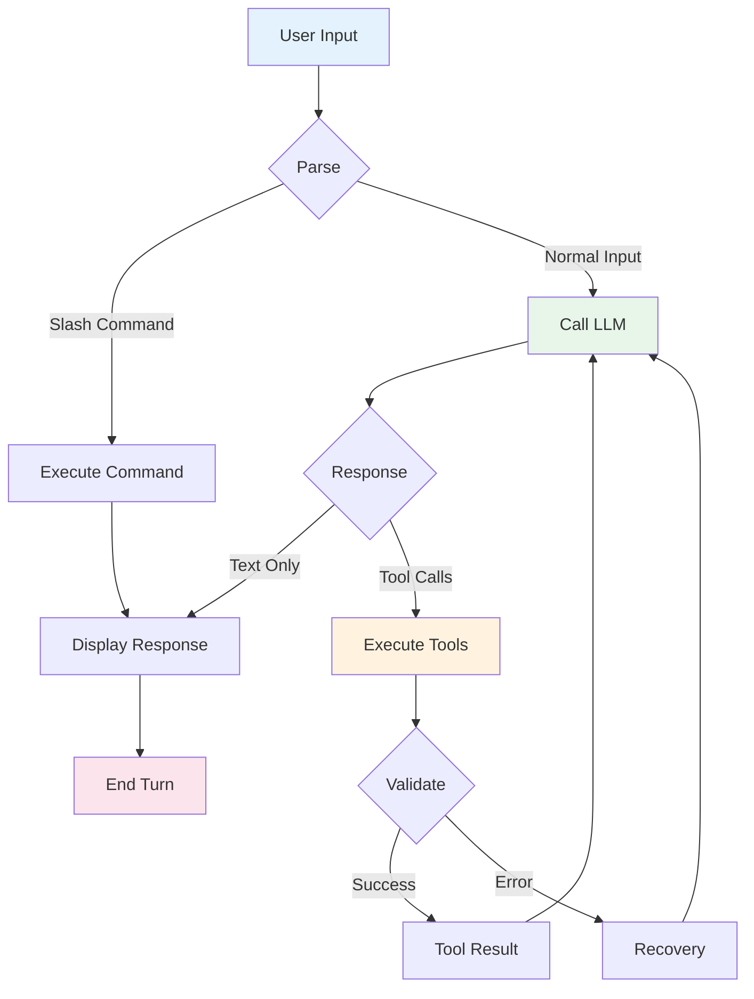
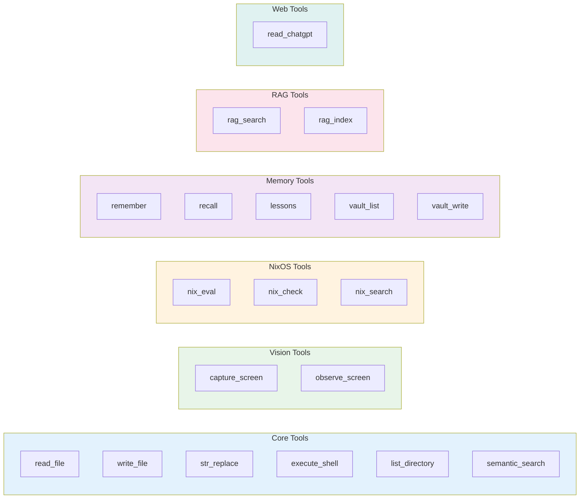
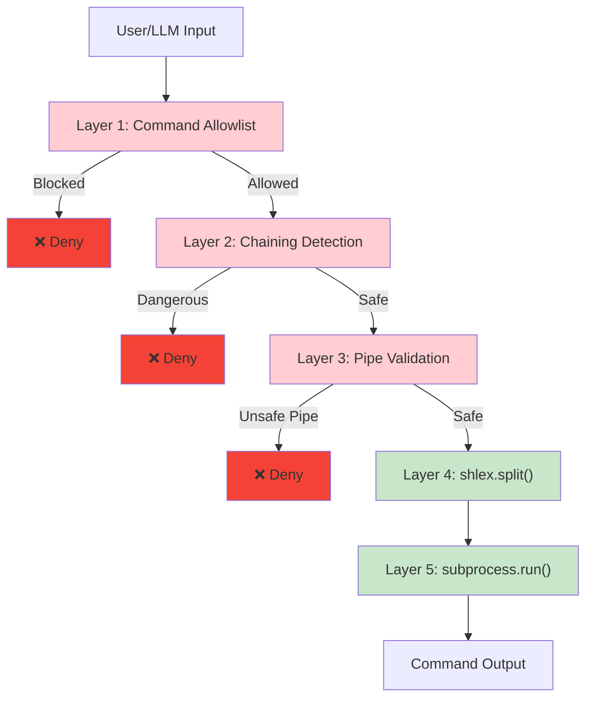
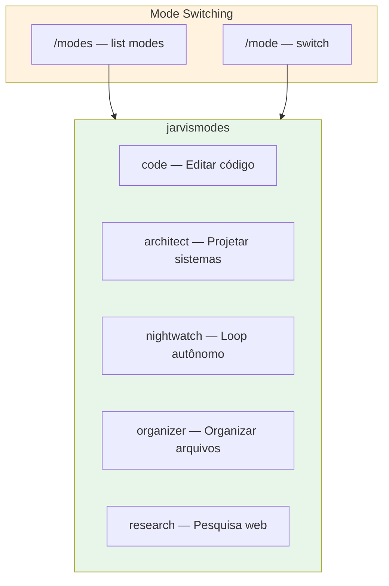
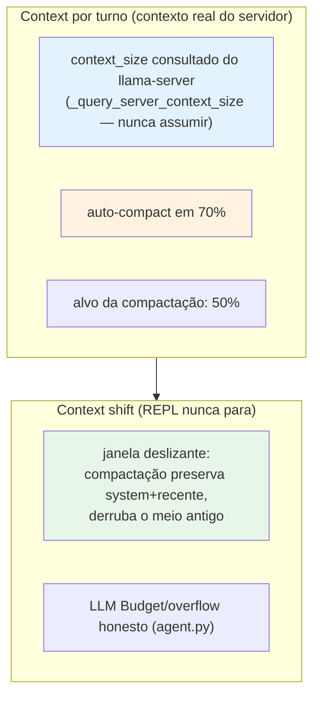

# 🤖 Agent Harness Architecture

> JARVIS agent design, tools, and execution loop.

## Agent Loop

## Tool Categories

## Security Layers

## Custom Modes

## Context Management

- O REPL **não para**: contexto estourando → auto-compact (70% → 50%)
  e segue o turno. Sem "contexto cheio, recomece".
- `context_size` vem DO SERVIDOR por turno (não hardcoded por modelo).

## Turn Hooks (fim de turno — o que desconfia antes de aceitar)

Ordem em `_run_agent_loop` (dev.py), todas bounded (contadores no loop):

1. **Promise-catcher (F1)**: "vou criar…" sem tool call → nudge com a
   tool anunciada + formato exato (máx 2×).
2. **Claim-checker (§11)**: declarou que escreveu X sem write_file de X
   na sessão → correção factual (máx 1×).
3. **Reopen-on-UNVERIFIED (25/09)**: com tool activity, `check_completion`
  (completion.py) verifica o MUNDO estruturalmente — arquivos escritos
   existem, .py compila, **instrução lida dentro de arquivo foi executada**
   (check `_unexecuted_read_instructions`). Missing de classe artefato →
   1 reopen com a lista (mesmo feedback que salva 5/12 no harness).
   Trailing-error sozinho NÃO reabre ("por que falhou?" é diagnóstico).
4. LoopDetector: repetição idêntica ×3 → abort honesto (STUCK ≠ done).

---
**Ver também:** [[nightwatch-components|nightwatch-components.md]] | [[mission-consolidation|mission-consolidation.md]]
[[mcp-integration|mcp-integration.md]] | [[context-engineering|context-engineering.md]] | [[ADR-001-agent-platform|ADR-001-agent-platform.md]]
[[ADR-002-memory-layers|ADR-002-memory-layers.md]] | [[system-overview|system-overview.md]]
[[../../HANDOFF|/home/nixos/projects/nixos-ai/AGENTS.md]] | [[../../AGENTS.md|/home/nixos/projects/nixos-ai/AGENTS.md]] | [[../../README|/home/nixos/projects/nixos-ai/docs/README.md]]
