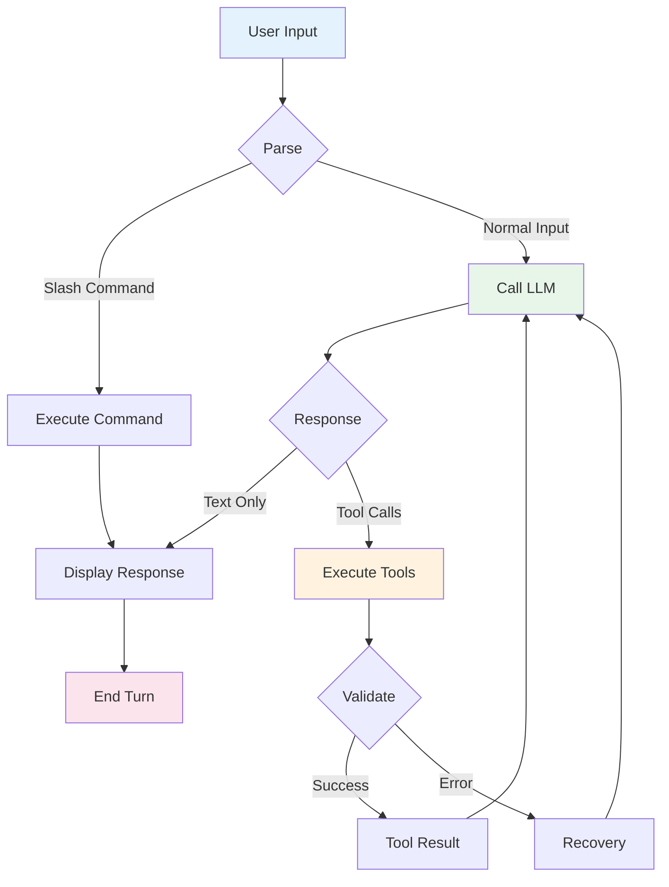
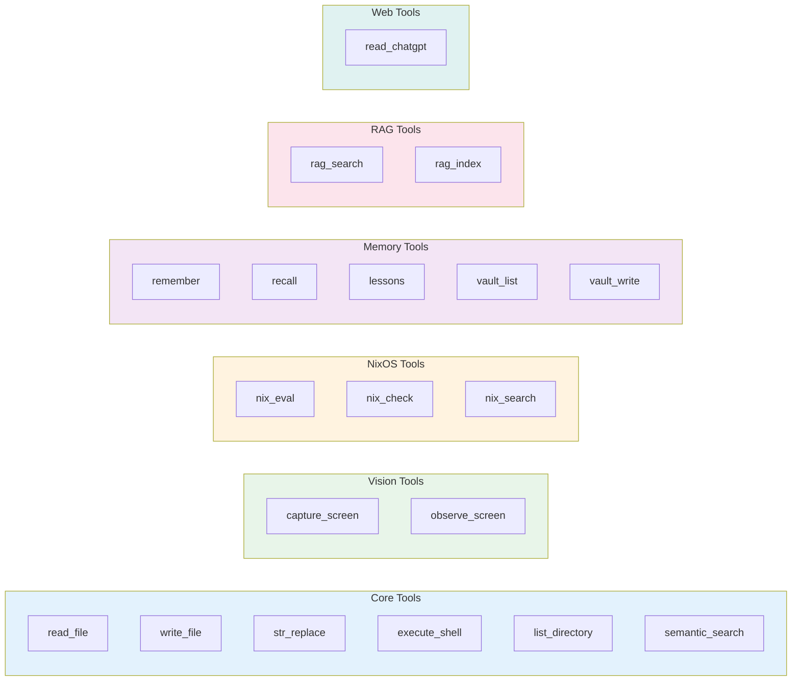
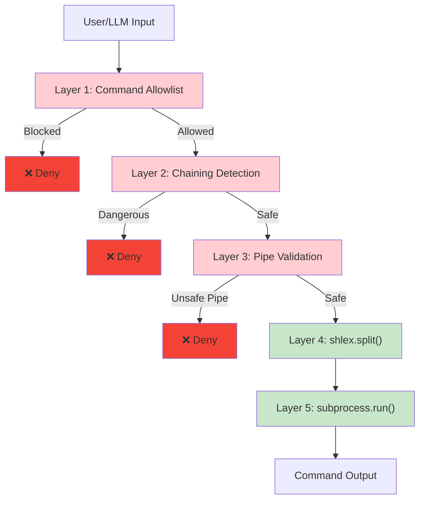
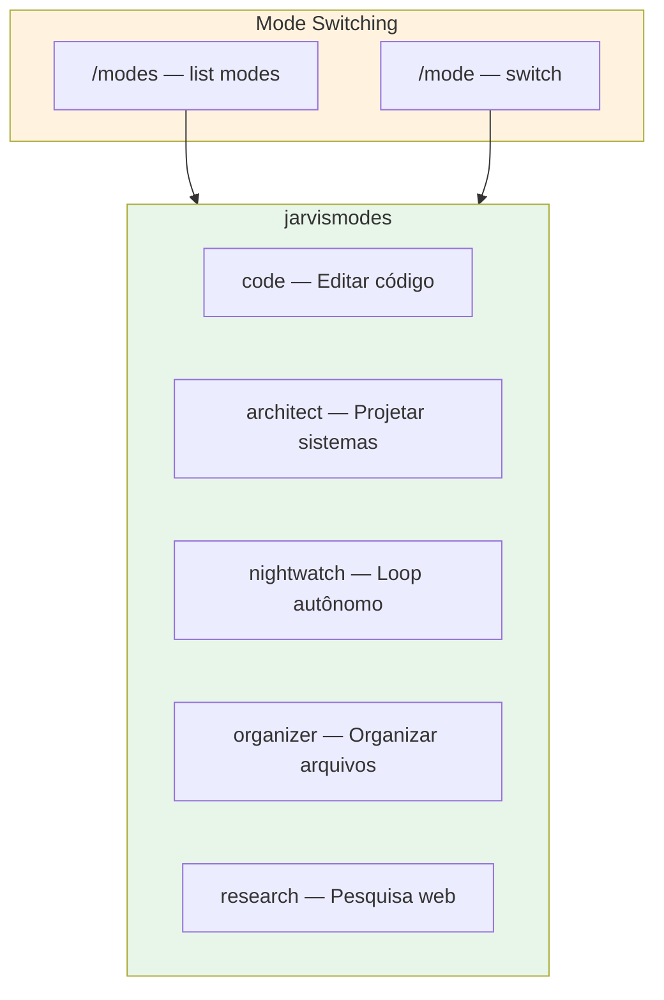
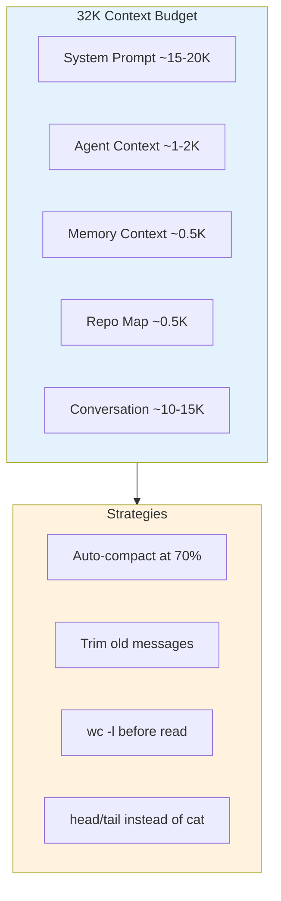

# 🤖 Agent Harness Architecture

> JARVIS agent design, tools, and execution loop.

## Agent Loop

```mermaid
flowchart TB
    Start["User Input"] --> Parse{"Parse"}
    Parse -->|Slash Command| Cmd["Execute Command"]
    Parse -->|Normal Input| LLM["Call LLM"]
    
    LLM --> Response{"Response"}
    Response -->|Text Only| Output["Display Response"]
    Response -->|Tool Calls| Tools["Execute Tools"]
    
    Tools --> Validate{"Validate"}
    Validate -->|Success| Result["Tool Result"]
    Validate -->|Error| Recover["Recovery"]
    
    Result --> LLM
    Recover --> LLM
    
    Cmd --> Output
    Output --> Done["End Turn"]
    
    style Start fill:#e3f2fd
    style LLM fill:#e8f5e9
    style Tools fill:#fff3e0
    style Done fill:#fce4ec
```

## Tool Categories

```mermaid
flowchart LR
    subgraph Core["Core Tools"]
        Read["read_file"]
        Write["write_file"]
        Replace["str_replace"]
        Shell["execute_shell"]
        List["list_directory"]
        Search["semantic_search"]
    end

    subgraph Vision["Vision Tools"]
        Capture["capture_screen"]
        Observe["observe_screen"]
    end

    subgraph NixOS["NixOS Tools"]
        Eval["nix_eval"]
        Check["nix_check"]
        NixSearch["nix_search"]
    end

    subgraph Memory["Memory Tools"]
        Remember["remember"]
        Recall["recall"]
        Lessons["lessons"]
        VaultList["vault_list"]
        VaultWrite["vault_write"]
    end

    subgraph RAG["RAG Tools"]
        RAGSearch["rag_search"]
        RAGIndex["rag_index"]
    end

    subgraph Web["Web Tools"]
        ChatGPT["read_chatgpt"]
    end

    style Core fill:#e3f2fd
    style Vision fill:#e8f5e9
    style NixOS fill:#fff3e0
    style Memory fill:#f3e5f5
    style RAG fill:#fce4ec
    style Web fill:#e0f2f1
```

## Security Layers

```mermaid
flowchart TB
    Input["User/LLM Input"] --> L1["Layer 1: Command Allowlist"]
    L1 -->|Blocked| Deny1["❌ Deny"]
    L1 -->|Allowed| L2["Layer 2: Chaining Detection"]
    L2 -->|Dangerous| Deny2["❌ Deny"]
    L2 -->|Safe| L3["Layer 3: Pipe Validation"]
    L3 -->|Unsafe Pipe| Deny3["❌ Deny"]
    L3 -->|Safe| L4["Layer 4: shlex.split()"]
    L4 --> L5["Layer 5: subprocess.run()"]
    L5 --> Output["Command Output"]

    style L1 fill:#ffcdd2
    style L2 fill:#ffcdd2
    style L3 fill:#ffcdd2
    style L4 fill:#c8e6c9
    style L5 fill:#c8e6c9
    style Deny1 fill:#f44336
    style Deny2 fill:#f44336
    style Deny3 fill:#f44336
```

## Custom Modes

```mermaid
flowchart TB
    subgraph Modes["jarvismodes"]
        Code["code — Editar código"]
        Arch["architect — Projetar sistemas"]
        Night["nightwatch — Loop autônomo"]
        Org["organizer — Organizar arquivos"]
        Res["research — Pesquisa web"]
    end

    subgraph Switching["Mode Switching"]
        slash["/modes — list modes"]
        switch["/mode <slug> — switch"]
    end

    slash --> Modes
    switch --> Modes

    style Modes fill:#e8f5e9
    style Switching fill:#fff3e0
```

## Context Management

```mermaid
flowchart TB
    subgraph Budget["32K Context Budget"]
        System["System Prompt ~15-20K"]
        Agent["Agent Context ~1-2K"]
        Memory["Memory Context ~0.5K"]
        RepoMap["Repo Map ~0.5K"]
        Conversation["Conversation ~10-15K"]
    end

    subgraph Strategies["Strategies"]
        Compact["Auto-compact at 70%"]
        Trim["Trim old messages"]
        Probing["wc -l before read"]
        HeadTail["head/tail instead of cat"]
    end

    Budget --> Strategies

    style Budget fill:#e3f2fd
    style Strategies fill:#fff3e0
```
