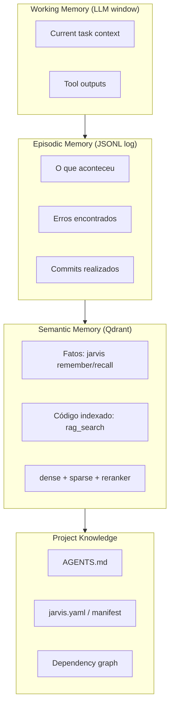

# Context Engineering — Protocolo de Contexto do JARVIS

> Formaliza as decisões de engenharia de contexto aplicadas ao JARVIS.
> Base: ADR-001 (D3), BUFFY §9, pesquisa OpenDev (arxiv 2603.05344) e
> Sourcegraph Context Engineering 2026.

## Os 4 Pilares (Sourcegraph 2026)

```
┌─────────────────────────────────────────────────┐
│              Context Engineering                 │
│                                                  │
│  1. Instructions   — O que fazer e como         │
│  2. Retrieval      — O que buscar e quando      │
│  3. Memory         — O que lembrar entre sessões│
│  4. Tools          — Como agir no ambiente      │
└─────────────────────────────────────────────────┘
```

## 1. Instructions (Pillar 1)

Camadas de instrução em ordem de precedência:

| Camada | Arquivo | Escopo |
|--------|---------|--------|
| Global | `~/projects/BUFFY.md` | Monorepo — epistemologia e qualidade |
| Monorepo | `~/projects/AGENTS.md` | Convenções operacionais e mapa de projetos |
| Projeto | `nixos-ai/AGENTS.md` | Regras específicas do projeto |
| Persona | `.roomodes` | Instruções por modo de trabalho |
| Handoff | `HANDOFF.md` | Contexto da sessão anterior |

**Regra de resolução**: o arquivo mais próximo ao arquivo editado prevalece.
BUFFY.md não tem precedência geográfica — aplica-se universalmente.

## 2. Retrieval (Pillar 2)

### Hierarquia de Context Assembly (OpenDev D3)

```
HANDOFF.md (~100 linhas, índice do estado atual)
    ↓
RAG search + Memory recall (just-in-time, só quando reduz incerteza)
    ↓
read_file() para módulos específicos (quando necessário)
```

### Anti-padrões a evitar

- **Ritual RAG**: chamar `recall()` / `rag_search()` em todo prompt sem necessidade
  > BUFFY §9: "Do NOT run RAG/recall/lessons blindly on every prompt."
- **Brute-force file reading**: ler o repositório inteiro em vez de recuperar o relevante
- **Context cliff**: chunks > 2500 tokens perdem contexto nas bordas (ver [[rag-improvements]])

### Configuração de Janela de Contexto

| Componente | Tokens consumidos | Tokens disponíveis |
|-----------|------------------|-------------------|
| System prompt | ~4-6K | — |
| Janela total (Qwen3.6) | 32.768 | — |
| Disponível para contexto | — | **~26-28K** |
| Context budget trigger | 70% de 32K | 22.938 tokens |

## 3. Memory (Pillar 3)

### As 4 Camadas (ADR-001 D7)



### Regra de Persistência

- **Working → Episodic**: automático ao final de cada task (checkpoint.py)
- **Episodic → Semantic**: via `jarvis remember` + embedding (Qdrant)
- **Project Knowledge**: atualização manual via commit + `jarvis index`

## 4. Tools (Pillar 4)

Ver [[mcp-integration]] para o mapa completo de ferramentas.

### Princípio de Lazy Tool Discovery

Não declarar todas as tools no prompt. Disponibilizar o subconjunto relevante
para o contexto corrente. Reduz noise e tokens desperdiçados.

| Contexto | Tools relevantes |
|----------|-----------------|
| Edição de código | `read_file`, `str_replace`, `execute_shell` (testes) |
| RAG/pesquisa | `rag_search`, `recall`, `tavily-search` |
| Nix/build | `nix_eval`, `nix_check`, `nix_search` |
| Observabilidade | `capture_screen`, `observe_screen` |

## Persona Handover (BUFFY §17)

Quando personas delegam trabalho, o relay de contexto deve ser via RAG, não
via histórico de conversa completo:

```
Persona A completa → escreve handoff doc em docs/ (~200-500 tokens)
    ↓
Persona B inicia → lê via RAG + AGENTS.md + projeto
    ↓
Sem transferência de histórico de conversa
```

**Por que funciona**: cada persona recebe janela de contexto limpa; o RAG
recupera apenas o que é relevante; handoff docs são auditáveis.

---
**Ver também:** [[mcp-integration]] | [[rag-improvements]] | [[agent-harness]]
[[ADR-001-agent-platform]] | [[ADR-002-memory-layers]] | [[system-overview]]
[[HANDOFF]] | [[../../BUFFY]]
