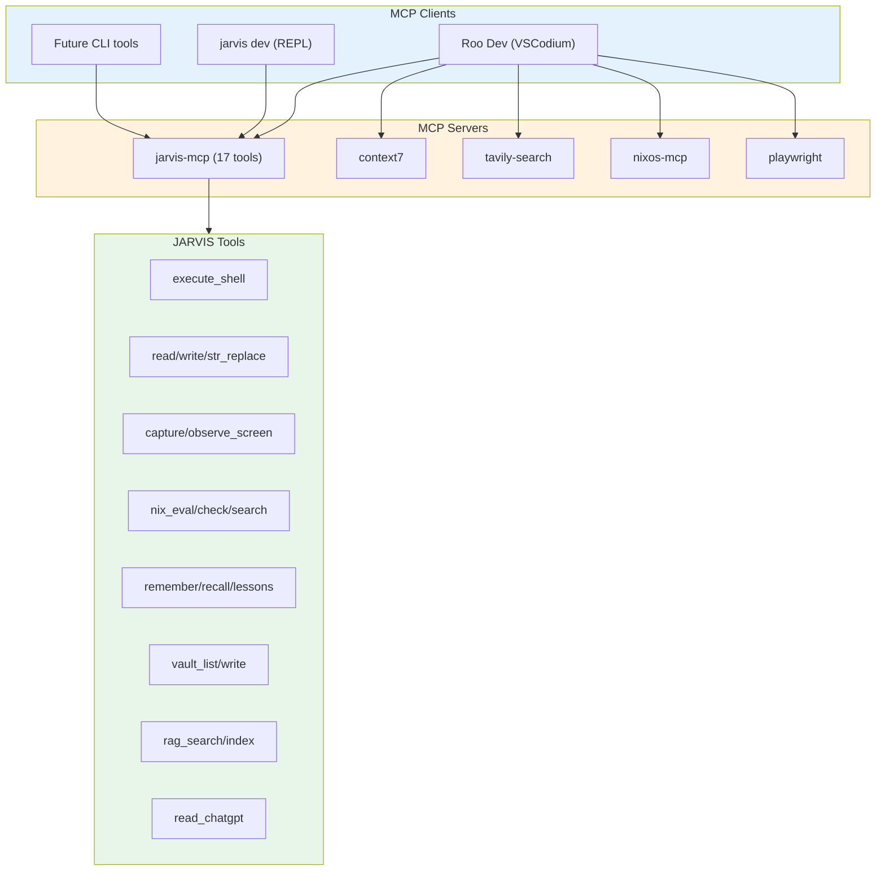
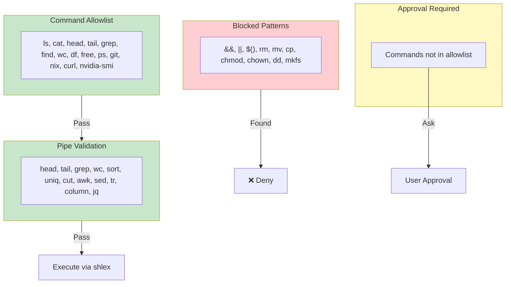

# 🔌 MCP Integration

> Model Context Protocol servers and their integration with Roo Dev.

## MCP Server Architecture



## Tool Mapping: REPL vs MCP

| Tool | REPL | MCP | Notes |
|------|------|-----|-------|
| read_file | ✅ | ✅ jarvis_read_file | Same implementation |
| write_file | ✅ | ✅ jarvis_write_file | Same implementation |
| str_replace | ✅ | ✅ jarvis_str_replace | Same implementation |
| execute_shell | ✅ | ✅ jarvis_execute | Both use shlex |
| list_directory | ✅ | ❌ | REPL only |
| semantic_search | ✅ | ❌ | REPL only |
| capture_screen | ✅ | ✅ jarvis_capture_screen | Same implementation |
| observe_screen | ✅ | ✅ jarvis_observe_screen | Same implementation |
| nix_eval | ✅ | ✅ jarvis_nix_eval | Same implementation |
| nix_check | ✅ | ✅ jarvis_nix_check | Same implementation |
| nix_search | ✅ | ✅ jarvis_nix_search | MCP proxies mcp-nixos |
| remember | ✅ | ✅ jarvis_remember | Same implementation |
| recall | ✅ | ✅ jarvis_recall | Same implementation |
| lessons | ✅ | ✅ jarvis_lessons | Same implementation |
| vault_list | ✅ | ✅ jarvis_vault_list | Same implementation |
| vault_write | ✅ | ✅ jarvis_vault_write | Same implementation |
| rag_search | ✅ | ✅ jarvis_rag_search | Same implementation |
| rag_index | ✅ | ✅ jarvis_rag_index | Same implementation |
| read_chatgpt | ✅ | ✅ jarvis_read_chatgpt | Same implementation |

## MCP Configuration (VSCodium)

```json
{
  "mcpServers": {
    "jarvis": {
      "command": "nix-shell",
      "args": ["-p", "python3", "--run", "python3 -m jarvis.mcp_server"],
      "env": {}
    },
    "context7": {
      "command": "npx",
      "args": ["-y", "@upstash/context7-mcp"]
    },
    "tavily-search": {
      "command": "nix-shell",
      "args": ["-p", "python3", "--run", "python3 -m tavily_mcp"],
      "env": { "TAVILY_API_KEY": "..." }
    },
    "nixos-mcp": {
      "command": "nix-shell",
      "args": ["-p", "mcp-nixos", "--run", "mcp-nixos"]
    },
    "playwright": {
      "command": "npx",
      "args": ["-y", "@playwright/mcp"]
    }
  }
}
```

## Security Model


