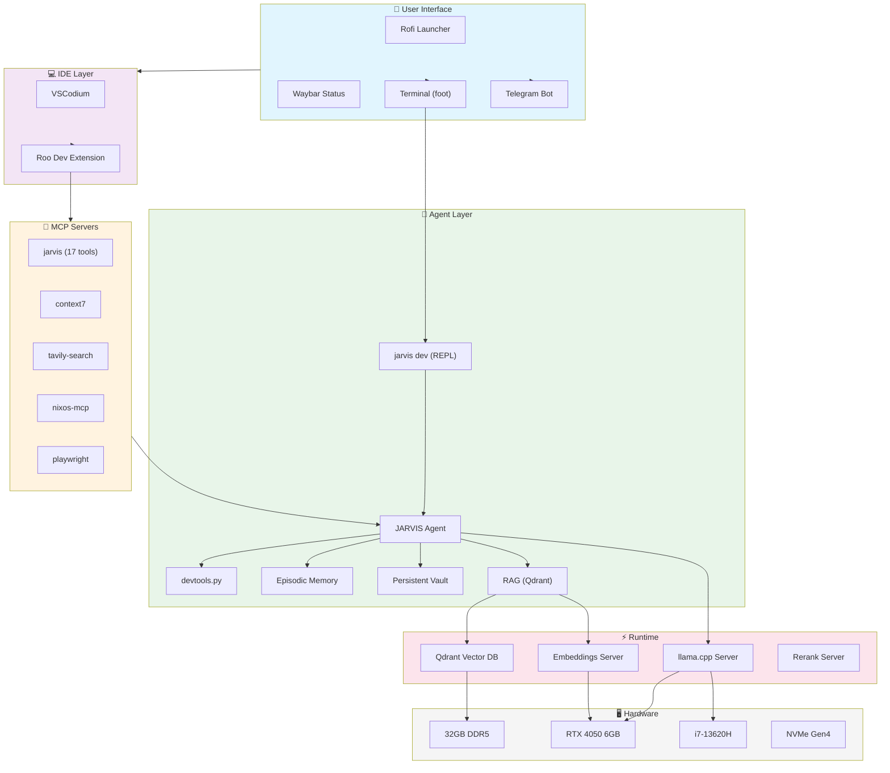
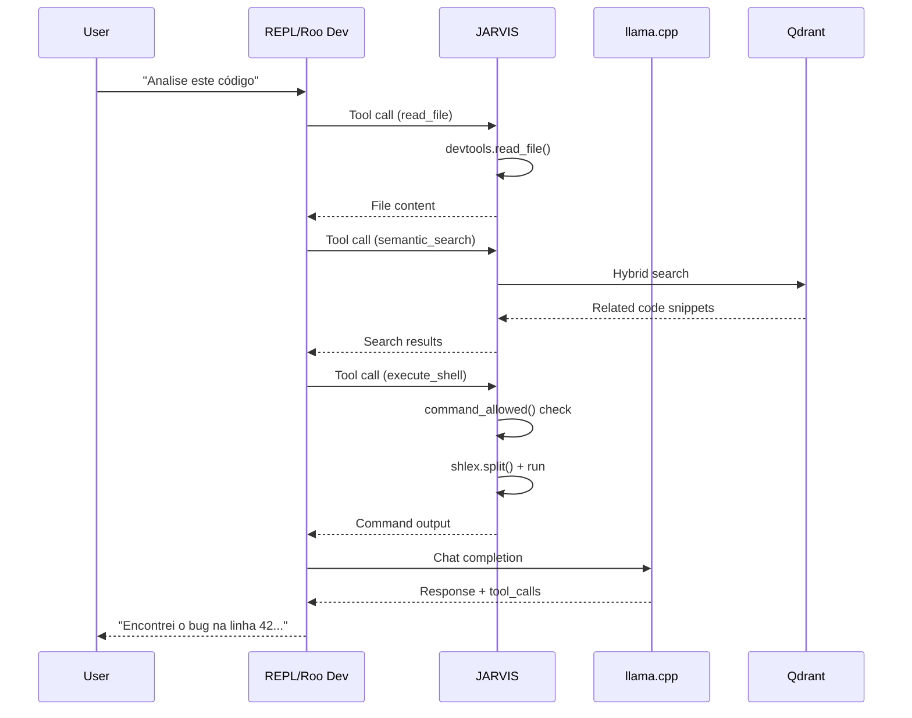
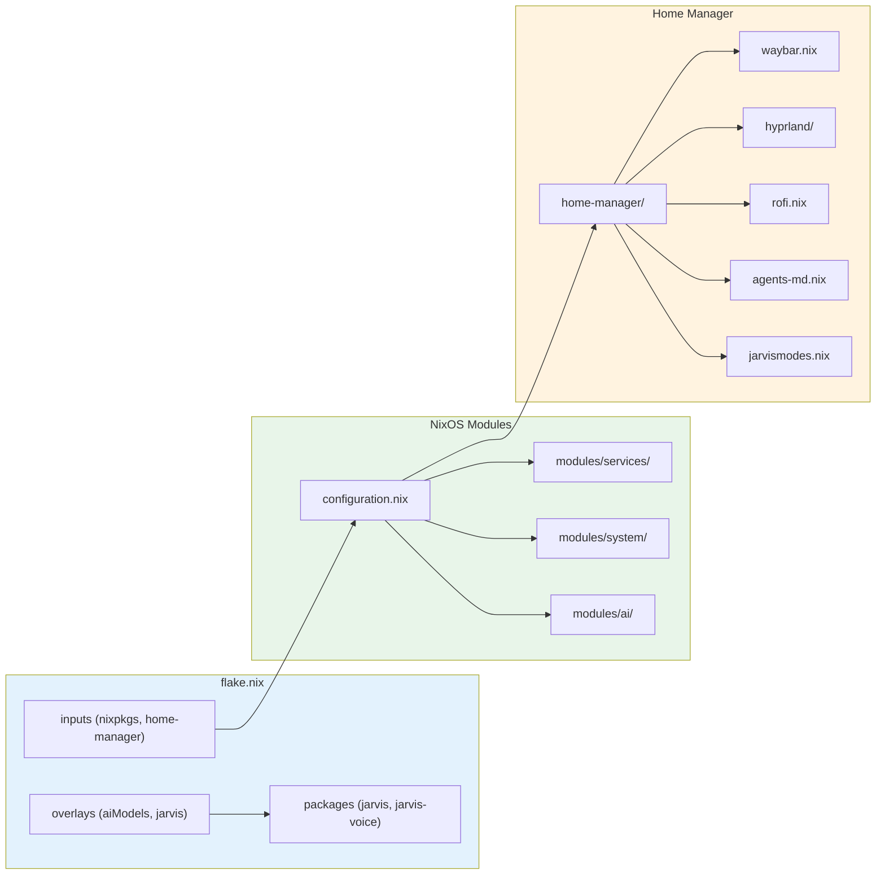
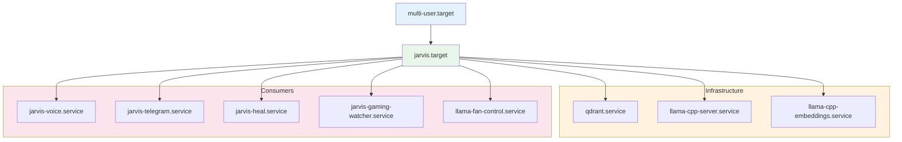

# 🏗️ System Architecture

> High-level overview of the nixos-ai system.

## System Diagram

## Data Flow

## NixOS Configuration Layers

## Service Topology

---
**Ver também:** [[../../HANDOFF]] | [[../../AGENTS.md]] | [[../../README]]
